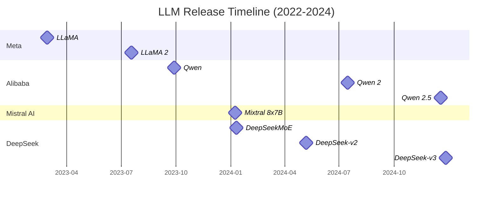

# A Brief History of Modern LLMs

## 📅 Timeline of Major LLM Releases



---
## Brief Summary of Models

### LLaMA
- Feb 2023, https://arxiv.org/abs/2302.13971
- The first open-source foundation LLM that caught massive public attention.
- Use a decoder-only architecture and made improvements
    - Use pre-norm instead of post-norm
    - Use untied embedding/output projection
    - Use RMSNorm instead of LayerNorm
    - Use SwiGLU instead of ReLU
    - Use RoPE instead of fixed positional embedding

```python
class MultiHeadAttention(nn.Module):
	def __init__(self, nheads, embd_dim):
		super().__init__()
		assert embd_dim % nheads == 0
		self.nheads = nheads
		self.embd_dim = embd_dim
		self.head_dim = int(self.embd_dim/self.nheads)
		
		self.Wq = nn.Linear(embd_dim, embd_dim, bias=False)
		self.Wk = nn.Linear(embd_dim, embd_dim, bias=False)
		self.Wv = nn.Linear(embd_dim, embd_dim, bias=False)
		self.Wo = nn.Linear(embd_dim, embd_dim, bias=False)
	
	def forward(self, X: torch.Tensor):
		nb, seq_len, _ = X.shape
		
		q = self.Wq(X).view(nb, seq_len, self.nheads, self.head_dim).transpose(1,2)
		k = Self.Wk(X).view(nb, seq_len, self.nheads, self.head_dim).transpose(1,2)
		v = Self.Wv(X).view(nb, seq_len, self.nheads, self.head_dim).transpose(1,2)
		
		q = apply_rope(q)
		k = apply_rope(k)
		
		# (nb, nh, sl, hd)@(nb, nh, hd, sl) -> (nb, nh, sl, sl)
		score = torch.matmul(q, k.transpose(2, 3))/ (self.head_dim**0.5)
		weights = F.softmax(score, dim=-1)
		
		# (nb, nh, sl, sl)@(nb, nh, sl, hd) -> (nb, sl, embd)
		o = torch.matmul(weights, v)
		o = o.transpose(1,2).contiguous().view(nb, seq_len, self.embd_dim)
		
		return self.Wo(o)

class FFN(nn.Module):
	def __init__(self, embd_dim, hidden_dim):
		super().__init__()
		self.gate = nn.Linear(embd_dim, hidden_dim, bias=False)
		self.up = nn.Linear(embd_dim, hidden_dim, bias=False)
		self.down = nn.Linear(hidden_dim, embd_dim, bias=False)
	
	def forward(self, X):
		# (nb, sl, embd) -> (nb, sl, hd)
		gated = self.gate(X)
		gated = F.silu(gated)
		up = self.up(X)
		hidden = gated * up
		return self.down(hidden)
		
		
class RMSNorm(nn.Module):
	def __init__(self, embd_dim, eps=1e-8):
		super().__int__()
		self.eps = eps
		self.weights = nn.Parameter(torch.ones(embd_dim))
	
	def forward(self, X):
		# (nb, sl, embd)
		return X * torch.sqrt(X.pow(2).mean(dim=-1, keepdim=True) + self.eps) * self.weights
	
class DecoderBlock(nn.Module):
	def __init__(self, nheads, embd_dim):
		super().__init__()
		
		self.mha = MultiHeadAttention(nheads, embd_dim)
		self.ff = FFN(embd_dim)
		self.attn_norm = RMSNorm(embd_dim)
		self.ff_norm = RMSNorm(embd_dim)
	
	def forward(self, X):
		# PreNorm
		h = self.mha(self.attn_norm(X)) + X
		return self.ff(self.ff_norm(h)) + h
	
class LLaMA(nn.Module):
	def __init__(self, nlayers, nheads, embd_dim, vocab_size):
		super().__init__()
		self.embedding = nn.Embedding(vocab_size, embd_dim)
		self.layers = nn.ModuleList([DecoderBlock(nheads,embd_dim) for _ in range(nlayers)])
		self.norm = RMSNorm(embd_dim)
		#Untied embedding/projection
		self.output = nn.Linear(hidden_dim, vocab_size, bias=False)
	
	def forward(self, inputs):
		x = self.embedding(inputs)
		for layer in self.layers:
			x = layer(x)
		x = self.norm(x)
		return self.output(x)
```


### LLaMA2
- Jul 2023, https://arxiv.org/abs/2307.09288
- They found LLaMA1 match the performance of closed pre-trained competitors like GPT-3. However it is not suitable substitute for closed “product” LLMs, such as ChatGPT, BARD, and Claude. These closed product LLMs are heavily fine-tuned to align with human preferences, which greatly enhances their usability and safety.
- From a model architecture point of view, the only substantial change compared to LLaMA1 is LLaMA2 uses Grouped Query Attention (GQA).
<div style="text-align: center;">
  
  <em>Figure 1: Grouped query attention (GQA).</em>
</div>


```python
class GroupedQueryAttention(nn.Module):
	def __init__(self, n_heads, n_kv_heads, embd_dim):
		super().__init__()
		
		assert n_heads % n_kv_heads == 0
		
		self.embd_dim = embd_dim
    self.n_heads = n_heads
    self.n_kv_heads = n_kv_heads
    self.head_dim = embd_dim // n_heads
    self.n_repeat = self.n_heads // self.n_kv_heads
    
		self.W_q = nn.Linear(embd_dim, embd_dim, bias=False)
		self.W_k = nn.Linear(embd_dim, self.n_kv_heads * self.head_dim, bias=False)
		self.W_v = nn.Linear(embd_dim, self.n_kv_heads * self.head_dim, bias=False)
		self.W_o = nn.Linear(embd_dim, embd_dim, bias=False)
	
	def forward(self, X):
		nb, seq_len, _ = X.shape
		
		q = self.W_q(X).view(nb, seq_len, self.n_heads, self.head_dim).transpose(1, 2)
		k = self.W_k(X).view(nb, seq_len, self.n_kv_heads, self.head_dim).transpose(1, 2)
		v = self.W_v(X).view(nb, seq_len, self.n_kv_heads, self.head_dim).transpose(1, 2)
		
		# (nb, nkv, sl, hd) --> (nb, nh, sl, hd)
		k = k.repeat_interleave(self.n_repeat, dim = 1)
		v = v.repeat_interleave(self.n_repeat, dim = 1)

		score = torch.matmul(q, k.transpose(2, 3))/(self.head_dim**0.5)
		weight = F.softmax(score, dim = -1)
		# (nb, nh, sl, sl) @ (nb, nh, sl, hd) -> (nb, sl, nh * hd)
		o = torch.matmul(weight, v).transpose(1, 2).contiguous().view(nb, seq_len, -1)
		return self.W_o(o)
```


### Qwen
- Sep 2023, https://arxiv.org/abs/2309.16609
- Built on LLaMA architecture.
    - Similarities:
        - Use untied weights for embedding and output projection to achieve better performance with the price of memory costs.
        - Use SwiGLU activation.
        - Use PreNorm and RMSNorm
    - Changes:
        - Remove biases for most layers except in QKV layer of attention to enhance the extrapolation ability.
        ```python
        self.Wq = nn.Linear(embd_dim, embd_dim, bias=False)
        self.Wk = nn.Linear(embd_dim, embd_dim, bias=False)
        self.Wv = nn.Linear(embd_dim, embd_dim, bias=False)
        self.Wo = nn.Linear(embd_dim, embd_dim, bias=False)
        ```
        - Incorporates LogN-Scaling and window attention: LogN-Scaling rescales the dot product of the query and value by a factor that depends on the ratio of the context length to the training length, ensuring that the entropy of the attention value remains stable as the context length grows. Window attention restricts the attention to a limited context window, preventing the model from attending to tokens that are too far away.
        ```python
        # LogN-Scaling
        logn_scaling_factor = torch.log(cur_seq_len) / torch.log(max_seq_len)
        scores = scores / (self.head_dim ** 0.5) * logn_scaling_factor

        # Window attention
        causal_mask = torch.triu(torch.ones(seq_len, seq_len), diagonal=1).bool()
        window_mask = torch.triu(torch.ones(seq_len, seq_len), diagonal=self.window_size + 1).bool()
        # Combine the masks
        mask = torch.logical_or(causal_mask, window_mask)
        scores = scores.masked_fill(mask, float('-inf'))
        ```

### Mixtrial 8x7B
- Dec 2023, https://arxiv.org/abs/2401.04088
- Considered first successful MOE implementation in modern LLM that caught massive public attention.
- Sparse MoE (top 2 experts activated out of 8): each experts is the same size as the 7B feed forward layer. At each time step, different experts are activated according to a TopK-softmax router, and the output

<div align="center">

$$
\sum_{i=0}^{n-1} \mathrm{G}(x)_i \cdot \mathrm{E}(x)_i \quad ; \quad \mathrm{G}(x) = \text{Softmax}\left(\text{TopK}\left(x \cdot W_g\right)\right)
$$

$$
y = \sum_{i=0}^{n-1}\text{Softmax}\left(\text{Top2}\left(x·W_g\right)\right)_i · \text{SwiGLU}_i\left(x\right)
$$
</div>

```python
class SwiGLU(nn.Module):
	# This is the implementation of a single expert
	def __init__(self, hid_dim, inter_dim):
		super().__init__()
		self.gate = nn.Linear(hid_dim, inter_dim, bias=False)
		self.up = nn.Linear(hid_dim, inter_dim, bias=False)
		self.down = nn.Linear(inter_dim, hid_dim, bias=False)
		
	def foward(self, X):
		# X: nb, seq_len, hid_dim
		return self.down(self.up(X) * F.silu(self.gate(X)))


class SpareMOE(nn.Module):
	def __init__(self, hid_dim, inter_dim, nexperts, k=2):
		super().__init__()
		self.router = nn.Linear(hid_dim, nexperts)
		self.nexperts = nexperts
		self.k = k
		self.expters = nn.ModuleList(
			[SwiGlU(hid_dim, inter_dim) for _ in range(nexperts)]
		)
		
	def forward(self, X):
		# This X would be the attention output
		nb, seq_len, hid_dim = X.shape
		flatten = X.view(-1, hid_dim) # (nb * seq_len, hid_dim)
		
		top_k_weights, top_k_index = torch.topk(self.router(flatten), self.k, dim= -1)
		# nb * seq_len, k
		top_k_weights = F.softmax(top_k_weights, dim=-1)
		
		out = torch.zeros_like(flatten)
		for exp_idx in range(self.nexperts):
			expert_mask = top_k_index == exp_idx # (nb * seq_len, k)
			token_mask = expert_mask.any(dim = -1) #(nb * seq_len)
			if not expert_tokens_mask.any():
        continue
			
			expert_weigts = top_k_weights[expert_mask] # (nb * seq_len, k)
			expert_output = self.expters[epx_idx](flatten[token_mask]) #(nb * seq_len, hid_dim)
			out[token_mask] += expert_output * expert_weigts
		
		return out
```

### DeepSeekMoE
- Jan 2024 https://arxiv.org/abs/2401.06066
- Identified key issues with existing MOEs : expert lack specialization, preventing them from reaching the theoretical upper-bound performance of MoE models
    - Knowledge Hybridity: existing MoE practices often employ a limited number of experts, expert will be likely to cover diverse knowledge.
    - Knowledge Redundancy: tokens assigned to different experts may require common knowledge.
- proposed solutions
    - Fine-Grained Expert Segmentation
    - Shared Expert Isolation
    - Load Balance:
        - Expert level balance loss: penalize high token-expert affinity, avoid tokens being routed to a smaller group of experts
        - Device level balance loss: balance compute

```python
#https://huggingface.co/deepseek-ai/deepseek-moe-16b-base/blob/main/modeling_deepseek.py

class SwiGLU(nn.Module):
	# This is the implementation of a single expert
	def __init__(self, hid_dim, inter_dim):
		super().__init__()
		self.gate = nn.Linear(hid_dim, inter_dim, bias=False)
		self.up = nn.Linear(hid_dim, inter_dim, bias=False)
		self.down = nn.Linear(inter_dim, hid_dim, bias=False)
		
	def foward(self, X):
		# X: nb, seq_len, hid_dim
		return self.down(self.up(X) * F.silu(self.gate(X)))
		
	
class DeepSeekMOE(nn.Module):
	def __init__(self, n_share_experts, n_other_experts, k, hid_dim, inter_dim):
		super().__init__()
		self.k = k
		self.n_other_experts = n_other_experts
		self.share_experts = nn.SwiGLU(hid_dim, n_share_experts * inter_dim)
		self.other_experts = nn.ModuleList([
			SwiGLU(hid_dim, inter_dim) for _ in range(n_oterh_experts)
		])
		self.router = nn.Linear(hid_dim, n_other_experts)
	
	def foward(self, X):
		nb, seq_len, hid_dim = X.shape
		flatten = X.view(-1, hid_dim)
		top_weights, top_index = torch.topk(self.router(X), self.k, dim=-1)
		top_k_weights = F.softmax(top_k_weights, dim=-1)
		
		out = torch.zeros_like(flatten)
		for exp_idx in range(self.n_other_experts):
			expert_mask = top_index == exp_idx # (nb * seq_len, k)
			token_mask = expert_mask.any(dim=-1) # (nb * seq_len,)
			if not expert_tokens_mask.any():
        continue
			
			expert_weights = top_weights[expert_mask]
			out[token_mask]+=self.other_experts[exp_idx](flatten[token_mask])*expert_weights
		out = out.view(nb, seq_len, hid_dim)
		
		out = out + self.share_experts(X)
		return out
```
<div style="text-align: center;">
  
  <em>Figure 2: DeepSeekMOE: Fine-grained experts & shared experts.</em>
</div>

### DeepSeek-v2
- Jun 2024, https://arxiv.org/abs/2405.04434
- Scaling parameters at computational cost hitting a wall, more efficient training/inference architectures are need.
- Apply DeepSeekMoE and Multi-head Latent Attention (MLA)
<div style="text-align: center;">
  
  <em>Figure 2: Multi-head latent attention (MLA).</em>
</div>

- MLA reduce both memory footprint and computational cost:
    - During training, the attention computation is performed in the much smaller latent space by the "weight absorption" trick, which significant reduce computational cost.
        - The attention score would then be: $\text{Softmax}\left(\left(W^{UQ}q_c\right)\left(W^{UK}k_c\right)^T\right)$. Since matrix multiplication is associative, the up-projection matrices can be fused: $\text{Softmax}\left(q_c\left(W^{UQ}\right)^TW^{UK}k_c^T\right)$.
        - This means the model computes the attention scores directly on the latent vectors  using a fused weight matrix , effectively performing the calculation in the lower-dimensional latent space.
    - During memory bound inference (decoding phase), the KV cache is computed and stored in the latent space, which greatly reduce memory footprint.

```python 

# https://github.com/deepseek-ai/DeepSeek-V3/blob/main/inference/model.py
class MLA(nn.Module):
	def __init__(self, dim, nheads, nope_dim, rope_dim):
		"""
			dim: input hidden dimension: 512
			nheads: number of attention heads: 8
			nope_dim: non-positional embedding dimension in each head: 64
			rope_dim: positional embedding dimension in each head: 32
			
		"""
		super().__init__()
		self.dim = dim
		self.nheads = nheads
		self.nope_dim = nope_dim
		self.rope_dim = rope_dim	
		self.head_dim = nope_dim + rope_dim
		
		self.w_dkv = nn.Linear(dim, nheads * nope_dim, bias=False)
		# self.w_uk = nn.Linear(nheads * nope_dim, dim, bias=False)
		# self.w_uv = nn.Linear(nheads * nope_dim, dim, bias=False)
		self.w_dq = nn.Linear(dim, nheads * nope_dim, bias=False)
		# self.w_uq = nn.Linear(nheads * nope_dim, dim, bias=False)
		
		self.w_qr = nn.Linear(dim, nheads * rope_dim, bias=False)
		self.w_kr = nn.Linear(dim, nheads * rope_dim, bias=False)
		
		self.w_o = nn.Linear(nheads * nope_dim, dim, bias=False)
	
	def forward(self, X):
		nb, seqlen, dim = X.shape
		c_kv = self.w_dkv(X).view(nb, seqlen, self.nheads, self.nope_dim)
		c_q = self.w_dq(X).view(nb, seqlen, self.nheads, self.nope_dim)
		pos_k = self.w_kr(X).view(nb, seqlen, self.nheads, self.rope_dim)
		pos_q = self.w_qr(X).view(nb, seqlen, self.nheads, self.rope_dim)
		
		latent_k = torch.cat([c_kv, pos_k], dim=-1).transpose(1, 2)
		latent_q = torch.cat([c_q, pos_q], dim=-1).transpose(1, 2)
		# attention in latent dimension
		score = torch.matmul(latent_q, latent_k.transpose(-2, -1))/(self.head_dim**0.5)
		weight = F.softmax(score, dim=-1) # nb, nh, seq, seq
		o = torch.matmul(weight, c_kv.permute(0,2,1,3)).transpose(1, 2) # nb, seq, nh,nope
		
		#up projection with weight absorption
		return self.w_o(o.view(nb, seqlen, -1))
```

### DeepSeekNSA
- Feb 2025, https://arxiv.org/abs/2502.11089
- While MLA solves the memory bottleneck of the KV cache during inference, the attention computation itself still scales quadratically with sequence length. NSA is  designed to tackle this computational problem by dynamically and hierarchically selecting only the most relevant tokens to attend to, which reduces the computational cost of the attention mechanism itself. Ref:https://zhuanlan.zhihu.com/p/24841366485
- NSA reduces per-query computation by organizing keys and values into temporal blocks and processing them through three attention paths: compressed coarse-grained tokens, selectively retained fine-grained tokens, and sliding windows for local contextual information.
    - $o^*_t = \sum_{c\in C} g^c_t ·Attn\left(q_t, \tilde{K}^c_t, \tilde{V}^c_t\right)$ ; the final output is a linear combination of three attention paths, the gate sore is derived from input features via an MLP and sigmoid activation.
    - For the `compression strategy`,a learnable MLP with intra-block position encoding maps keys in a block to a single compressed key. Attention computation is then carried out using the compressed keys.
    - For the `top-k block-wise selection strategy`, the compression attention score is used to select the most relevant blocks, these blocks are concatenated into a single sequence and used in attention computation.
    - For the `sliding windows strategy`, the most recent tokens within a given window size are used in attention computation.
    - To further prevent shortcut learning across attention branches with marginal computational overhead, we provide independent keys and values for three branches.

<div style="text-align: center;">
  
  <em>Figure 2: Native sparse attention (NSA).</em>
</div>

```python

class DeepSeekNSA(nn.Module):
	
	def __init__(self, nheads=8, dim=512, block_size=4, seq_len=1024, top_k=2, comp_len=1, wind_size=128):
		super().__init__()
		self.nheads = nheads
		self.dim = dim
		assert dim % nheads == 0
		self.head_dim = dim // nheads
		self.block_size = block_size
		self.seq_len = seq_len
		assert seq_len % block_size == 0
		self.block_len = seq_len//block_size
		self.top_k = top_k
		self.comp_len = comp_len
		self.wind_size = wind_size
		self.w_q = nn.Linear(dim, dim, bias=False)
		self.w_k = nn.Linear(dim, dim, bias=False)
		self.w_v = nn.Linear(dim, dim, bias=False)
		self.unfold = nn.Unfold(kernel_size = (1, block_len), stride = block_len) #non-overlapping
		self.sliding = nn.Unfold(kernel_size = (1, wind_size), stride = 1) #sliding window
		self.w_comp = nn.Linear(self.block_len, comp_len, bias=False)
		self.gate = nn.Linear(dim, 3, bias=False)
		
	def forward(self, X):
		bs, seq_len, dim = X.shape
		
		Q = self.w_q(X).view(bs, seq_len, self.nheads, self.head_dim)
		# bs, seq_len, nheads, dim --> bs, nheads, hdim, seq_len
		K = self.w_k(X).view(bs, seq_len, self.nheads, self.head_dim).permute(0,2,3,1)
		V = self.w_v(X).view(bs, seq_len, self.nheads, self.head_dim).permute(0,2,3,1)
		Q = apply_pos_embd(Q)
		K = apply_pos_embd(K)
		
		# Branch 1: compression attention
		# 1.1 split the full K, V into sub k, v
		K = K.reshape(bs*self.nheads, self.head_dim, 1, seq_len)
		V = V.reshape(bs*self.nheads, self.head_dim, 1, seq_len)
		sub_ks = self.unfold(K) # bs * nheads, hdim * block_size, block_len
		sub_vs = self.unfold(V) # bs * nheads, hdim * block_size, block_len
		
		sub_ks = sub_ks.view(bs, self.nheads, self.head_dim, self.block_size, self.block_len)
		sub_vs = sub_vs.view(bs, self.nheads, self.head_dim, self.block_size, self.block_len)
		
		# 1.2 compress and concat
		cmp_k = self.w_comp(sub_ks).reshape(bs, self.nheads, self.head_dim, -1) #bs, nheads, hdim, compressed_len
		cmp_v = self.w_comp(sub_vs).reshape(bs, self.nheads, self.head_dim, -1) #bs, nheads, hdim, compressed_len
		
		# 1.3 calculate attention score
		score = torch.matmul(Q.permute(0,2,1,3), cmp_k)/(self.head_dim**0.5) # bs, nheads, seq_len, compressed_len
		weight = F.softmax(score, dim=-1) # bs, nheads, seq_len, compressed_len
		o_cmp = torch.matmul(weight, cmp_v.transpose(2,3)) # bs, nheads, seq_len, hdim
		o_cmp = o_cmp.transpose(1,2).contiguous().view(bs, seq_len, dim)
		
		# Branch 2: selection attention
		# 2.1 select topK by weights
		weight = weight.sum(dim = 1)# bs, seq_len, compressed_len
		scale, indx = torch.topk(weight, dim=2, k=self.top_k) # bs, seq_len, topk
		
		# bs, nheads, hdim, nblock, block_len --> bs, nheads, hdim, seq_len, nblock, block_len
		sub_ks_expand = sub_ks.unsqueeze(3).expand(bs, self.nheads, self.head_dim, seq_len, self.block_size, self.block_len)
		sub_vs_expand = sub_vs.unsqueeze(3).expand(bs, self.nheads, self.head_dim, seq_len, self.block_size, self.block_len)

		indx_expanded = indx.unsqueeze(1).unsqueeze(2).unsqueeze(-1)  # bs, 1, 1, seq_len, top_k, 1
		indx_expanded = indx_expanded.expand(bs, self.nheads, self.head_dim, seq_len, self.top_k, self.block_len)
		
		sel_k = torch.gather(sub_ks_expand, dim=-2, indx_expanded) # bs, nheads, hdim, seq_len, topk, block_len
		sel_v = torch.gather(sub_vs_expand, dim=-2, indx_expanded) # bs, nheads, hdim, seq_len, topk, block_len
		
		# concat
		sel_k = sel_k.view(bs, self.nheads, self.head_dim, seq_len, -1)
		sel_v = sel_v.view(bs, self.nheads, self.head_dim, seq_len, -1)
		
		# share k, v across all heads
		share_sel_k = sel_k.sum(dim = 1) # bs, hdim, seq_len, topk*block_len
		share_sel_v = sel_v.sum(dim = 1) # bs, hdim, seq_len, topk*block_len
		
		# 2.2 calculate attention score
		sel_score = torch.einsum("bshd,bdsk->bhsk", Q, share_sel_k)/(self.head_dim**0.5) # bs, nheads, seq_len, topk*block_len
		sel_weight = F.softmax(sel_score, dim=-1)
		o_sel = torch.einsum("bhsk,bdsk->bhsd", sel_weight, share_sel_v) # # bs, nheads, seq_len, hdim
		o_sel = o_sel.transpose(1,2).contiguous().view(bs, seq_len, dim)
		
		# Branch 3: sliding window
		# 3.1 prepare sliding window
		pad_len = self.wind_size - 1
		# bs*nheads, hdim, 1, seq_len --> bs*nheads, hdim, 1, seq_len+pad_len
		K = F.pad(K, (0, pad_len), value=0.0) # pad to the end
		V = F.pad(V, (0, pad_len), value=0.0)
		wind_ks = self.sliding(K) # bs * nheads, hdim * seq_len, wind_size
		wind_vs = self.sliding(V) # bs * nheads, hdim * seq_len, wind_size
		
		wind_ks = wind_ks.view(bs, self.nheads, self.head_dim, seq_len, self.wind_size)
		wind_vs = wind_vs.view(bs, self.nheads, self.head_dim, seq_len, self.wind_size)
		
		# 3.2 calculate attention score
		sw_score = torch.einsum("bshd,bhdsw->bhsw", Q, wind_ks)/(self.head_dim**0.5) # bs, nheads, seq_len, wind_size
		sw_weight = F.softmax(sw_score, dim=-1)
		o_sw = torch.einsum("bhsw,bhdsw->bshd", sw_weight, wind_vs) # bs, seq_len, nheads, hdim
		o_sw = o_sw.contiguous().view(bs, seq_len, dim)
		
		# combine output
		gate_score = self.gate(X) # bs, seq_len, 3
		gate_score = F.sigmoid(gate_score).unsqueeze(2) # bs, seq_len, 1, 3
		outputs = torch.stack([o_cmp, o_sel, o_sw], dim=-1)  # (bs, seq_len, dim, 3)
		
		o_final = torch.sum(outputs * routing_weights, dim=-1)  # (bs, seq_len, dim)
		
		return o_final

```